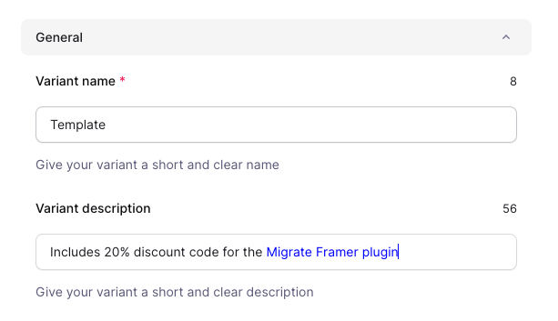
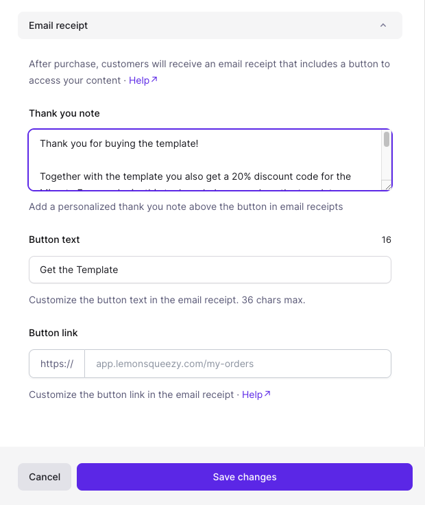
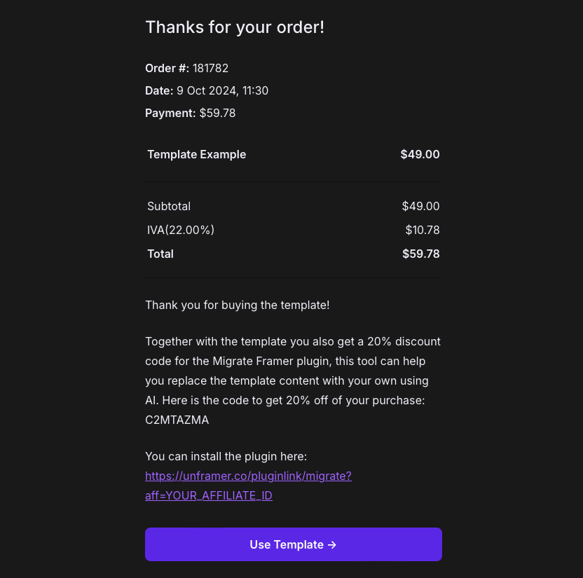

export const DISCOUNT_PERCENTAGE = "30%";

# How to bundle "Migrate" Framer plugin discount with template sales

This guide will show how you can earn more revenue by bundling a discount code for the [Migrate Framer plugin](https://www.framer.com/marketplace/plugins/migrate--atog5qz8imo0pji1b10z8alr7/) with your template sales.

After completing this process you can earn {DISCOUNT_PERCENTAGE} from all plugins sales coming from your templates sales. Your customers will benefit too! They will be able to rewrite the template content faster and more easily, saving them time.

## 1. Register to the LemonSqueezy affiliate program

By registering to the LemonSqueezy affiliate program, you will earn a commission on all sales of the plugin from your customers.

You can register here: [https://unframer.lemonsqueezy.com/affiliates](https://unframer.lemonsqueezy.com/affiliates)

After registering you will get an affiliate id, after redirecting users to an url like https://unframer.co/pluginlink/migrate?aff=YOUR_AFFILIATE_ID you will earn a commission.

## 2. Update your product description

You can tell your buyers about the discount code in your LemonSqueezy product description. Here is an example of what you can add to your template description:

> Includes {DISCOUNT_PERCENTAGE} discount code for the Migrate Framer plugin

You an use the following link in the description to redirect to the plugin page: https://www.framer.com/marketplace/plugins/migrate--atog5qz8imo0pji1b10z8alr7/

## 3. Add the plugin discount code to your LemonSqueezy receipt

Here is a template for the LemonSqueezy receipt, you can obviously customize it to your needs:

> Thank you for buying the template!
>
> As a bonus with your template purchase, you get a {DISCOUNT_PERCENTAGE} discount code for the Migrate Framer plugin. This powerful tool uses AI to help you effortlessly replace the template content with your own. Use the code C2MTAZMA to enjoy {DISCOUNT_PERCENTAGE} off your plugin credits.
>
> You can install the plugin here: https://unframer.co/pluginlink/migrate?aff=YOUR_AFFILIATE_ID

Add this text in your LemonSqueezy receipt settings:

Replace YOUR_AFFILIATE_ID with the affiliate id you got in the first step.

## 4. Automatically open the Migrate plugin after customers buy the template

You can add this query param to your template remix link to automatically open the plugin after a customer buys the template:

https://framer.com/projects/new?duplicate=\{YOUR_PROJECT_ID\}&plugin=atog5qz8imo0pji1b10z8alr7

> Simply add `&plugin=atog5qz8imo0pji1b10z8alr7` at the end of your Framer remix link, the Migrate plugin will open automatically after the customer opens the template. Making the migration process easier for them.

## The customers buying flow

1. The customer buys your template from LemonSqueezy
1. The customer receives a receipt with plugin discount code via email, it will look something like this:
   
1. The customer clicks the link with your referral id, you will get a commission from the plugin purchase
